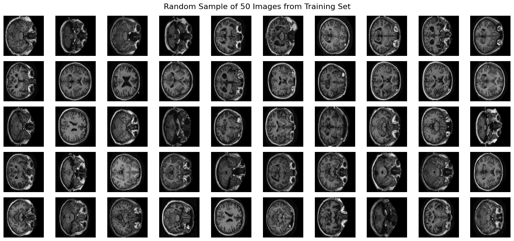
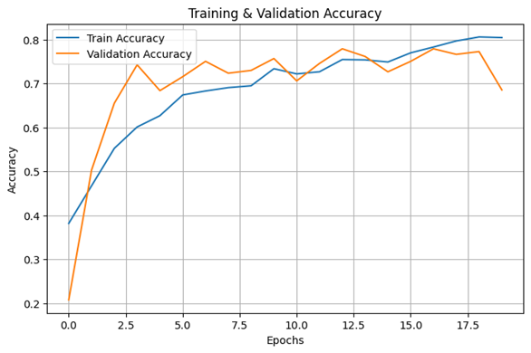
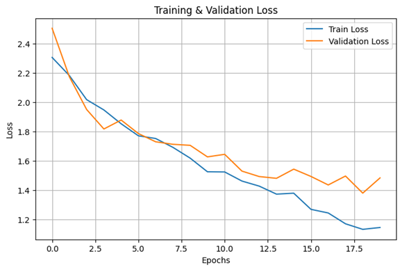
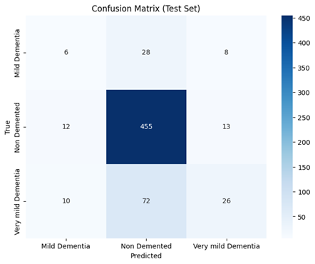
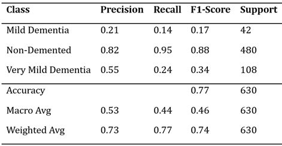

# Alzheimer’s Disease MRI Classification Using Convolutional Neural Networks
Python | TensorFlow/Keras | MobileNetV2 | Medical Image Classification

## Overview
This project develops a deep learning model to classify Alzheimer's disease severity from MRI brain scans. The goal is to explore how convolutional neural networks (CNNs) can be used for medical image classification tasks.

The model is trained using MRI images from the OASIS dataset and uses transfer learning with MobileNetV2 to classify images into three dementia categories.

---

## Dataset
Dataset: **OASIS MRI Dataset**

Source: Kaggle
https://www.kaggle.com/datasets/ninadaithal/imagesoasis

The dataset contains MRI brain scan images categorized into dementia stages:
- Non-Demented
- Very Mild Dementia
- Mild Dementia

Each MRI scan contains multiple slices per patient representing different cross-sections of the brain. To reduce redundancy and ensure consistent representation, specific slices (119–121) were selected for model training.

## Example MRI Images

The following figure shows a random sample of MRI slices from the dataset used for model training.

  

## Data Preprocessing
Several preprocessing steps were implemented to prepare the images for model training:
- MRI slices **119-121** were selected for each patient
- Randomly sampled images per patient to maintain dataset balance
- Resized images to **224 x 224 pixels**
- Applied **image normalization**
- Implemented **data augmentation** including:
  - Rotation
  - Zoom
  - Brightness Adjustment
  - Horizontal flipping

A **patient-level train/test split (70/30)** was used to prevent data leakage between training and testing datasets.

## Model Architecture
The model uses **transfer learning with MobileNetV2** pretrained on ImageNet.

Key components:
- MobileNetV2 base model (frozen layers)
- Fine-tuning of final convolutional layers
- Additional convolutional layer
- Global average pooling
- Dense layer (256 units)
- Dropout for regularization
- Softmax output layer for 3-class classification

**Loss Function:** 
Categorical Cross-Entropy

**Optimizer:**
Adam

---

## Class Imbalance
To improve model performance for underrepresented classes, the following approaches were used:
- Class weighting during model training
- Image augmentation to increase variability

---

## Model Evaluation
Model performance was evaluated using:
- Test set accuracy
- Confusion matrix
- Classification report (precision, recall, F1-score)

---

## Results
The CNN model achieved a **test accuracy of 77.3%** when classifying MRI slices into three dementia categories using transfer learning with MobileNetV2.

### Training Results
The training and validation curves illustrate how the model learned over time. Training accuracy improved steadily while validation accuracy stabilized near the final performance level. The validation loss fluctuated during training, reflecting instability caused by class imbalance in the dataset.

  

  

### Confusion Matrix
The confusion matrix highlights that the model performed well on the **Non-Demented class**, but struggled with minority classes.

  

### Classification Report
The classification report summarizes precision, recall,a nd F1-scres for each class. While the model performed strongly on the majority class, recall for the minority classes was significantly lower due to dataset imbalance.

  

### Class-Specific Performance
While the model performed well on the **Non-Demented class** (95% recall), performance on minority classes was lower due to **strong class imbalance** in the dataset:
- **Non-Demented:** 95% recall (455/480 correctly classified)
- **Very Mild Dementia:** 24% recall
- **Mild Dementia:** 14% recall

Despite using **class weighting and data augmentation**, the model still tended to predict the majority class. This highlights a common challenge in medical imaging tasks where limited examples exist for early disease stages. 

Overall, the results demonstrate that transfer learning with MobileNetV2 can capture meaningful patterns from MRI data, but performance is strongly influenced by dataset size and class distribution.

---

## Tools and Libraries
- Python
- TensorFlow / Keras
- NumPy
- Matplotlib
- Scikit-learn

---

## Future Improvements
Possible extensions for this project include:
- Experimenting with different CNN architectures
- Increasing dataset size
- Applying cross-validation
